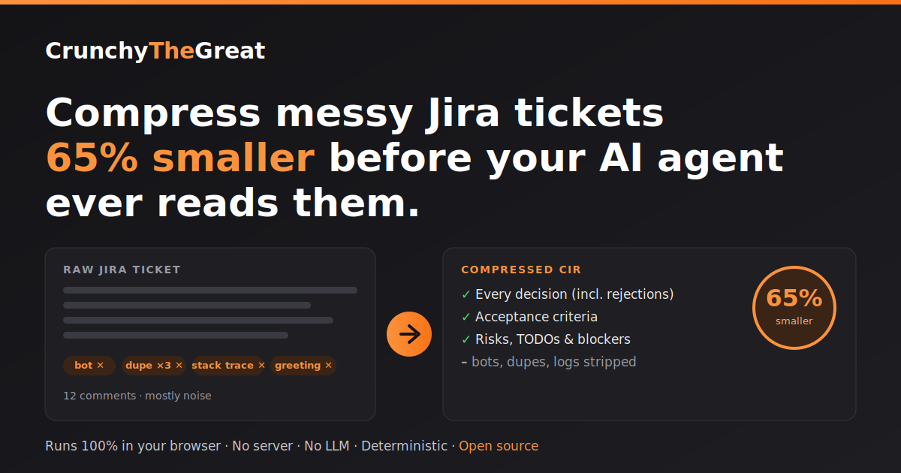
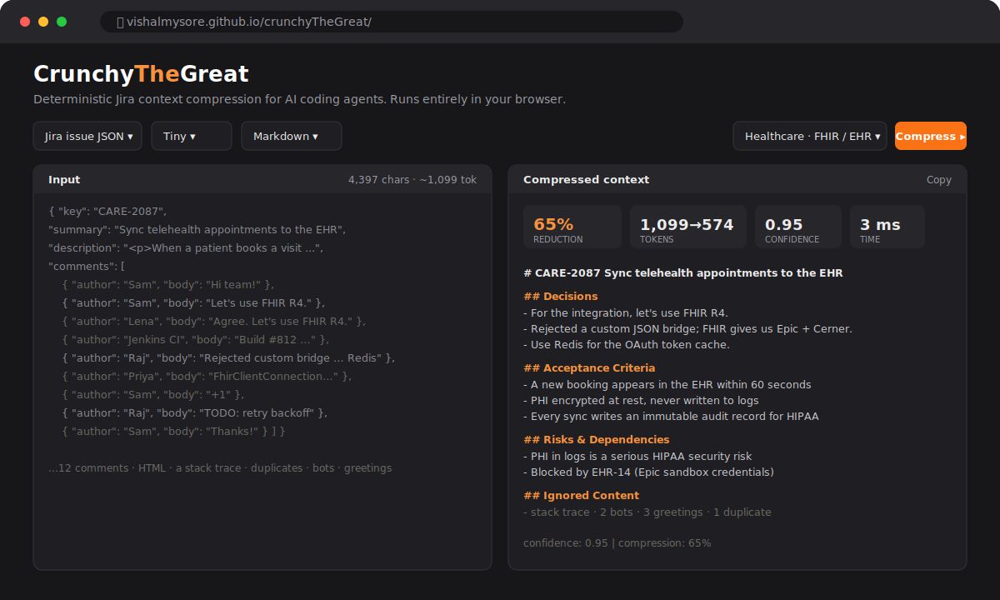
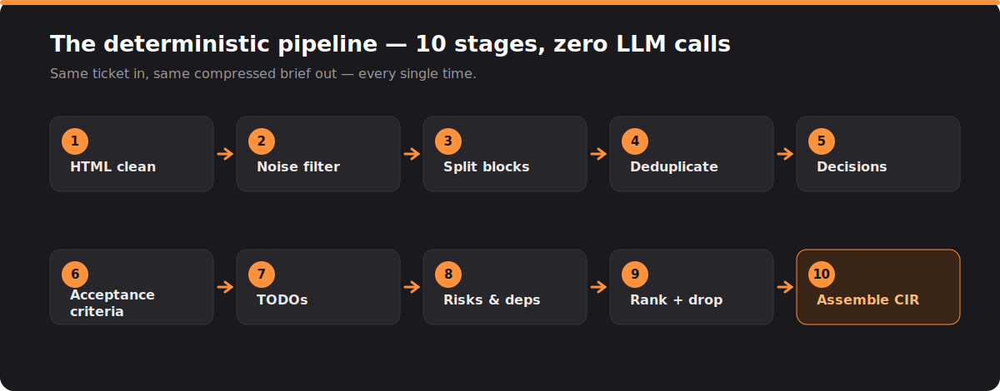

<p align="center">
  
</p>

<p align="center">
  <strong><a href="https://vishalmysore.github.io/crunchyTheGreat/">🚀 Try the live demo</a></strong> &nbsp;·&nbsp;
  <a href="https://github.com/vishalmysore/crunchyTheGreat">⭐ Star on GitHub</a>
</p>

> **TL;DR** — Enterprise Jira tickets are ~80% noise. Your AI agent (Claude Code, Devin, Copilot, Codex, OpenHands) burns thousands of tokens reading bot spam, duplicate arguments, stack traces and "thanks!" comments before it finds the one architecture decision that actually matters. **CrunchyTheGreat** is an open-source engine that strips a ticket to a clean structured brief *before* the agent ever sees it — **60% fewer tokens** even on a tidy ticket, far more on a noisy one — deterministically, with **no LLM**, running **entirely in your browser**.

---

## The problem nobody budgets for: context bloat

Here's a dirty secret of AI-assisted engineering. When you paste a Jira ticket into your coding agent, this is what it actually reads:

| What's in the ticket | What the agent needs |
| --- | --- |
| 180 KB of comments | The 2 architecture decisions |
| 45 KB epic description | The acceptance criteria |
| 500 KB of attached logs | The one open blocker |
| Bot messages, `+1`, "thanks!" | Nothing |
| The same "let's use FHIR R4" said 3 times | Once |

Only **10–20%** of a typical ticket carries engineering signal. The rest is tax — paid in tokens, latency, dollars, and worst of all **answer quality**, because the good stuff gets buried in the noise and the model's attention gets diluted.

You *could* ask an LLM to summarize the ticket first. But now you're paying an LLM to read the noise so a second LLM can read a smaller version of it — and summarization is non-deterministic, so the same ticket gives you a different brief every run. Sometimes it quietly drops the one constraint that mattered.

There's a better way, and it doesn't involve a model at all.

## What if the ticket compressed itself?

<p align="center">
  
</p>

Paste a Jira export on the left. Get a clean, structured brief on the right. **60% fewer tokens, in single-digit milliseconds, and nothing leaves your browser tab.**

That example is one of three bundled (synthetic) tickets — spanning **healthcare, insurance and logistics** — each a realistic mess: 12 comments, an HTML-formatted description, a **stack trace** someone dumped in a comment, three separate people repeating the same decision, two bot messages, and a "Thanks!" at the end.

Here's what Crunchy keeps — and just as importantly, what it throws away:

```json
{
  "issue": "CARE-2087 Sync telehealth appointments to the EHR via FHIR",
  "businessGoal": "The appointment must appear in the clinician's EHR so that
                   front-desk staff stop re-typing bookings into Epic by hand.",
  "decisions": [
    "For the integration, let's use FHIR R4 (the Appointment and Slot resources).",
    "We considered a custom JSON bridge but rejected it — FHIR gives us Epic and Cerner for free.",
    "We also decided to use Redis for the OAuth token cache."
  ],
  "acceptanceCriteria": [
    "A new booking appears in the EHR within 60 seconds",
    "All patient identifiers (PHI) are encrypted at rest and never written to application logs",
    "Every sync writes an immutable audit record for HIPAA",
    "Given a patient books a slot When the FHIR sync worker processes the event Then the clinician sees the appointment in Epic"
  ],
  "risks": ["Appointment PHI showing up in logs is a serious HIPAA security risk"],
  "dependencies": ["Blocked by EHR-14 — the Epic sandbox credentials"],
  "todos": [
    "Add retry with exponential backoff for transient FHIR 5xx responses",
    "Write the PHI data-retention runbook before go-live"
  ],
  "ignoredContent": [
    "Log/stack-trace dump removed (784 chars)",
    "2 bot message(s) removed",
    "3 greeting/acknowledgement comment(s) removed",
    "1 duplicate/near-duplicate paragraph(s) collapsed"
  ],
  "confidence": 0.95,
  "compressionRatio": 0.65
}
```

Notice it kept the **rejected** option (the custom JSON bridge). Knowing what the team decided *not* to do is exactly as valuable to a coding agent as knowing what they chose — and it's the first thing a naive summarizer drops.

## Why deterministic beats "just ask GPT to summarize"

This is the core bet, so it's worth being blunt about it:

- **Same input → same output. Every time.** No temperature, no drift, no "why did the brief change between runs?" You can diff it, cache it, and trust it in CI.
- **Zero token cost to compress.** The pipeline is regex, text similarity and ranking — not a model. You spend tokens *once*, on the small clean brief, in the agent that does the actual work.
- **It runs offline.** No ticket data is shipped to a third-party API just to be shortened. For enterprise Jira behind a firewall, that's not a nice-to-have, it's the whole ballgame.
- **It's auditable.** Every dropped paragraph is *reported* in `ignoredContent`, so you can see exactly what was removed and why. Nothing vanishes silently.

An optional LLM pass is still supported for teams that want prose polish — but it's a layer *on top* of an already-compressed brief, not a substitute for one.

## Under the hood: 10 stages, no magic

<p align="center">
  
</p>

Each stage does one small, testable thing:

1. **HTML clean** — strip markup, email quotes, signatures.
2. **Noise filter** — drop bot messages, `+1`/`lgtm`/"thanks", emoji-only comments, and raw log dumps.
3. **Split** — break content into paragraph-level blocks.
4. **Deduplicate** — collapse "let's use Kafka" ×3 into one (repetition becomes a ranking *signal*, not clutter).
5–8. **Extract** — decisions (including rejections), acceptance criteria (sections, Gherkin `Given/When/Then`, checklists), TODOs, and risks/dependencies/blockers.
9. **Rank** — every block gets a value score; anything below your chosen threshold is dropped.
10. **Assemble** — emit the structured output with a confidence score and the measured compression ratio.

Four compression levels gate whole sections, so each emits strictly less than the one below it: **Tiny** (decisions + acceptance criteria — the irreducible brief), **Small** (+ constraints), **Medium** (+ risks), **Full** (+ dependencies and TODOs — everything except detected noise).

## The real unlock: one context format for every tool

The output isn't just "a smaller ticket." It's a **CIR — Context Intermediate Representation**: a standardized, source-agnostic JSON contract.

That means the *same* compressed shape can come from Jira today, and from GitHub Issues, Confluence, or Azure DevOps tomorrow — and any agent consumes it identically. Connectors on one side, a compression pipeline in the middle, a portable CIR on the other. That separation is what turns this from "a Jira utility" into **context infrastructure** for AI agents.

## It runs in your browser. Really.

The whole thing is a **zero-runtime-dependency TypeScript** build — about **7 KB gzipped**. No backend, no API keys, no upload. Open the tab, paste, compress. Your ticket never touches a server.

There's a **Java** reference implementation too (Spring-friendly, for JVM shops), plus a **Node CLI**:

```bash
npx tsx src/cli.ts -i ticket.json -f markdown -l tiny
```

Both share the same pipeline, the same CIR schema, and the same test suite.

## Try it in 10 seconds

1. Open **[the live demo](https://vishalmysore.github.io/crunchyTheGreat/)**
2. Pick a **domain sample** — payments, healthcare (FHIR/EHR), insurance (claims), or logistics (shipment tracking) — and hit **Load**
3. Watch a messy 12-comment ticket collapse into a clean brief — and switch the **Level** from Full to Tiny to trade fidelity for size.

Then paste one of your *own* tickets. (It's all client-side — nothing is sent anywhere.)

If it saves you tokens, **[give it a ⭐ on GitHub](https://github.com/vishalmysore/crunchyTheGreat)** — it genuinely helps other engineers find it.

---

## FAQ

**Does CrunchyTheGreat send my Jira data anywhere?**
No. The browser app and the pipeline run entirely client-side. There is no server and no external API call in the default (deterministic) path.

**How is this different from an LLM summary?**
It's deterministic (same output every time), costs zero tokens to run, works offline, and reports exactly what it removed. An LLM pass is available as an optional enhancement, not a dependency.

**How much smaller are tickets, really?**
The bundled healthcare ticket's Markdown brief is **33% smaller at Full fidelity and 60% smaller at Tiny** (642 → 258 tokens) — while preserving every decision, acceptance criterion, risk and blocker. Noisier real-world tickets (the 500 KB log dumps and 180 KB comment threads above) compress far harder; that is where the 70–95% design target lives.

**Which agents does it help?**
Any token-limited coding agent: Claude Code, Devin, GitHub Copilot, Codex, OpenHands, Cursor — anything you paste ticket context into.

**Is it open source?**
Yes. Java + TypeScript, on [GitHub](https://github.com/vishalmysore/crunchyTheGreat). Contributions and new source connectors welcome.

**What's on the roadmap?**
Confluence and GitHub-Issues connectors, linked-issue expansion, attachment parsing, and a REST API — all emitting the same CIR.

---

<p align="center"><em>Built for engineers who'd rather their AI agent spent its context window on the code, not the "thanks!" comments.</em></p>

<p align="center">
  <a href="https://vishalmysore.github.io/crunchyTheGreat/">Live demo</a> ·
  <a href="https://github.com/vishalmysore/crunchyTheGreat">GitHub</a>
</p>
