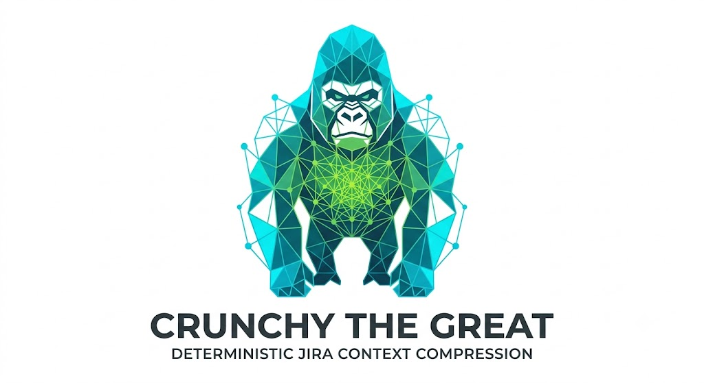
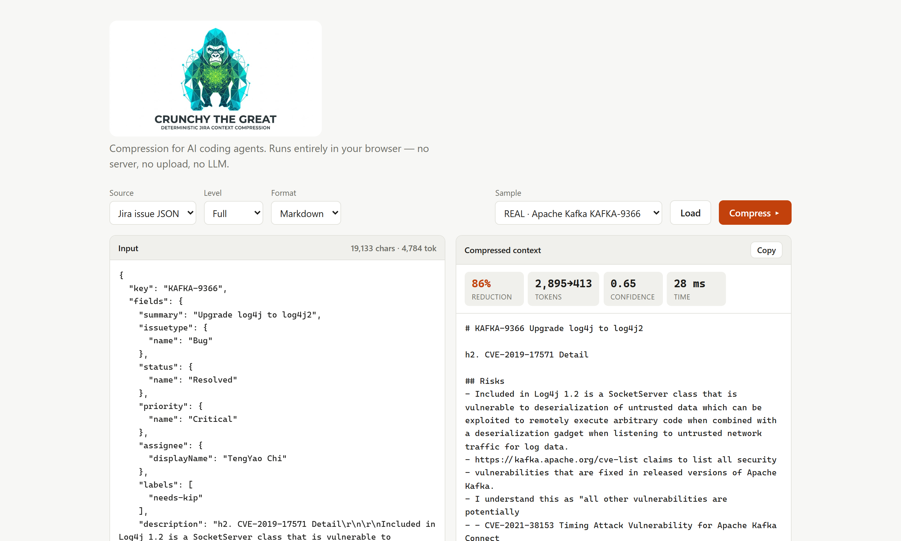
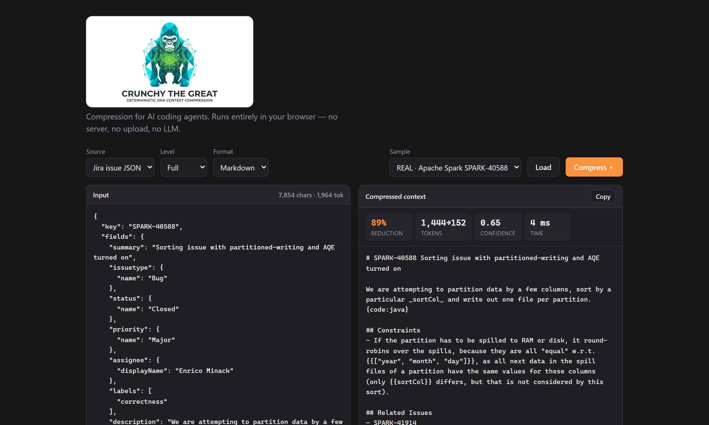
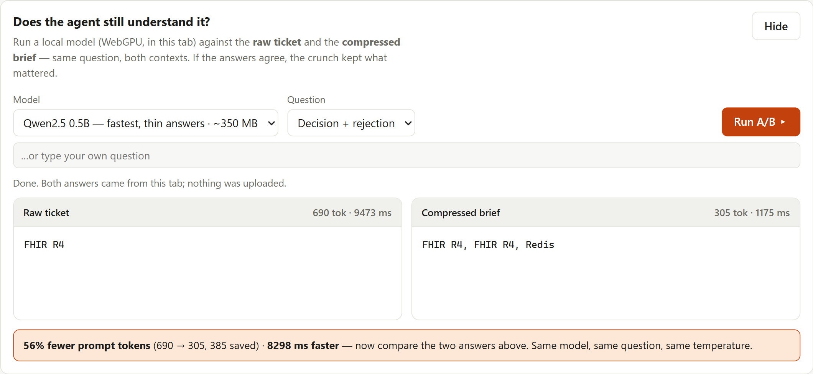

<p align="center">
  
</p>

<p align="center">
  <strong><a href="https://vishalmysore.github.io/crunchyTheGreat/">🚀 Try the live demo</a></strong> &nbsp;·&nbsp;
  <a href="https://github.com/vishalmysore/crunchyTheGreat">⭐ Star on GitHub</a>
</p>

> **TL;DR** — Enterprise Jira tickets are mostly noise. **CrunchyTheGreat** compresses one into a clean structured brief *before* your coding agent reads it: **86% fewer tokens on a real Apache Kafka ticket**, deterministically, with **no LLM**, running **entirely in your browser**. It also ships an A/B panel that runs a local model against the raw ticket and the compressed brief so you can check the agent still understands. The most useful thing I learned building it was that my own test data had been lying to me.

---

## The problem: your agent reads 19,133 characters to learn three facts

Here is a real ticket — [KAFKA-9366](https://issues.apache.org/jira/browse/KAFKA-9366), "Upgrade log4j to log4j2". Paste it into your agent and it reads **19,133 characters (4,784 tokens)** of JSON: 33 comments, CVE tables, bot messages, a mailing-list quote, people saying "+1".

What the agent actually needed: it's a security upgrade, here are the CVEs, here's what's blocked.



**2,895 → 413 tokens. 86% smaller. 28 milliseconds. No model involved.**

Paste on the left, structured brief on the right. Nothing leaves the tab.

## Real numbers, on real tickets

Every number below comes from a real, publicly-readable Apache ticket, fetched from their anonymous Jira REST API and bundled in the repo so you can reproduce them:

| Ticket | Comments | Raw | Compressed | Reduction |
| --- | --- | --- | --- | --- |
| [KAFKA-9366](https://issues.apache.org/jira/browse/KAFKA-9366) | 33 | 2,895 tok | 413 tok | **86%** |
| [SPARK-40588](https://issues.apache.org/jira/browse/SPARK-40588) | 8 | 1,444 tok | 152 tok | **89%** |
| [LUCENE-9004](https://issues.apache.org/jira/browse/LUCENE-9004) | 68 | 64 KB of text | — | **88%** |

Dark mode, because of course:



## The part I got wrong

Here's the bit worth your time, because it cost me a day.

I built the pipeline against three tickets I wrote myself — a healthcare FHIR sync, an insurance claims engine, a logistics tracker. Realistic-looking. Bot noise, duplicate decisions, a stack trace, greetings. They compressed **~33%**, and I published that number.

Then someone asked a fair question: *"the crunch is not very much?"*

They were right, and the reason was humbling. **I had written the test data to match my own regexes.** Every sample had an "Acceptance Criteria" heading because my extractor looks for one. Every sample said "let's use Kafka" because my decision-matcher looks for that phrasing. My benchmark was a mirror.

Real tickets don't look like that. When I finally ran actual Apache tickets through it:

- The compression ratio **tripled** (33% → 86-89%), because real tickets carry the noise mine only pretended to.
- The extraction **collapsed**. On all three real tickets: **zero acceptance criteria, 0–1 decisions.** Apache engineers don't write "Acceptance Criteria:" headings. `constraints` filled with any sentence containing "should" — including *"should we hook into ANN Benchmarks?"*, which is a question, not a constraint.

Both facts are true at once: the thing compresses real tickets far better than I claimed, *and* it understands them far worse. Neither would have surfaced from data I authored. The confidence score in the screenshots reads **0.65** on real tickets versus 0.95 on synthetic ones — that's the tool telling on itself, which is exactly what it should do.

### Two bugs only real data could find

**Non-breaking spaces.** Real Jira content is littered with `U+00A0`. JavaScript's `trim()` strips it; Java's `strip()` does **not** — `Character.isWhitespace()` explicitly excludes NBSP. So the Java and TypeScript implementations silently disagreed on a real ticket. My hand-written reproduction *passed*, because I typed a normal space. Only the real payload had the NBSP.

**`CVE-2019` filed as a related Jira issue.** The issue-key regex `[A-Z][A-Z0-9]{1,9}-\d+` happily matched a *prefix* of Kafka's `CVE-2019-12399`. Every real security ticket triggered it.

Both are now fixed, with regression tests, and the two implementations are **byte-identical across 5 samples × 4 levels**.

## Does the agent still understand it?

Compression ratio on its own is a vanity metric. `rm -rf` scores 100%. The only question that matters is whether the agent can still do the job.

So the app ships an A/B panel: it loads a small model via **WebLLM on WebGPU — in your tab** — and asks it the *same question* over the raw ticket and over the compressed brief.



That's a real run, not a mockup: **690 → 305 prompt tokens (56% fewer), and 8.3 seconds faster** — 9,473 ms down to 1,175 ms — with the compressed brief still naming the FHIR decision.

And note what the screenshot *doesn't* hide: that's Qwen2.5 0.5B, and its answers are thin. Neither arm named the rejected option. A model that weak is a poor judge of what compression lost, which is exactly why the default in the app is Llama-3.2-1B. Showing you the flattering run and hiding the rest would defeat the point of building a measurement tool.

## Why deterministic beats "just ask an LLM to summarise"

- **Same input → same output. Every time.** No temperature, no drift. You can diff it, cache it, trust it in CI.
- **Zero token cost to compress.** It's regex, text similarity and ranking — not a model. You spend tokens once, on the small brief.
- **It runs offline.** No ticket is shipped to a third-party API just to be shortened. For enterprise Jira behind a firewall that isn't a nice-to-have, it's the whole ballgame.
- **It's auditable.** Every removal is reported in `ignoredContent` — "2 bot messages removed", "1 duplicate collapsed". Nothing vanishes silently.

## Under the hood: 10 stages, no magic


Four levels gate whole sections, each strictly smaller than the last: **Tiny** (decisions + acceptance criteria), **Small** (+ constraints), **Medium** (+ risks), **Full** (+ dependencies and TODOs).

That gating is newer than it should be. For a while the levels were theatre — extraction ran *before* ranking, so every level emitted identical content while reporting different ratios. `tiny` claimed 60% and was actually *larger* than `full`. If your compression tool's headline metric can disagree with its own token counter, believe the token counter.

## The real unlock: one context format for every tool

The output isn't "a smaller ticket". It's a **CIR — Context Intermediate Representation**: a standardised, source-agnostic JSON contract.

```json
{
  "issue": "KAFKA-9366 Upgrade log4j to log4j2",
  "decisions": [], "constraints": [], "acceptanceCriteria": [],
  "risks": ["Included in Log4j 1.2 is a SocketServer class that is vulnerable to deserialization…"],
  "todos": [], "dependencies": [],
  "relatedIssues": ["KIP-719", "KAFKA-12399", "KAFKA-13660", "…"],
  "ignoredContent": ["1 bot message(s) removed", "1 duplicate/near-duplicate paragraph(s) collapsed"],
  "confidence": 0.65,
  "compressionRatio": 0.87
}
```

Those empty `decisions` and `acceptanceCriteria` arrays are the honest output, not a redaction — this is the gap described above, visible in the contract itself.

Connectors on one side, a compression pipeline in the middle, a portable CIR out the other. Jira today; GitHub Issues, Confluence, Azure DevOps tomorrow — same shape, any agent. That separation is what makes this context infrastructure rather than a Jira utility.

## It really does run in your browser

**Zero runtime dependencies** in the core. A visit transfers **11 kB**. WebLLM's 6 MB worker is lazy — nothing is fetched until you open the A/B panel.

There's a **Java** reference implementation too (for JVM shops), plus a Node CLI:

```bash
curl -s "https://issues.apache.org/jira/rest/api/2/issue/KAFKA-9366" -o ticket.json
npx tsx src/cli.ts -i ticket.json -f markdown -l full
```

Both share the same pipeline, the same CIR schema, and produce byte-identical output.

## Try it in 30 seconds

1. Open **[the live demo](https://vishalmysore.github.io/crunchyTheGreat/)**
2. Pick **REAL · Apache Kafka KAFKA-9366** and hit **Load**
3. Watch 2,895 tokens become 413 — then slide **Level** from Full to Tiny

Then paste one of your own tickets. It's all client-side; nothing is uploaded.

**[⭐ Star it on GitHub](https://github.com/vishalmysore/crunchyTheGreat)** — and if you know how Jira tickets are *actually* written in your org, the extraction heuristics are where contributions would help most.

---

## FAQ

**Does it send my Jira data anywhere?**
No. The compressor and the optional local model both run client-side. There's no server and no external API call.

**Can it fetch a ticket from a URL for me?**
No, and not for lack of trying. Apache, Jenkins and MongoDB all allow anonymous REST reads, but none send `Access-Control-Allow-Origin`, so the browser blocks it. A proxy would work but would send your ticket to a stranger's server — which would break the only promise worth making here. `curl` it and paste.

**How much smaller, really?**
86–89% on real Apache tickets at full fidelity. Around 33% on tidy hand-written ones — a tidy ticket has less to throw away. Your mileage depends on how noisy your Jira is.

**Which agents does it help?**
Any token-limited coding agent: Claude Code, Devin, Copilot, Codex, OpenHands, Cursor.

**What's the biggest known weakness?**
Extraction is tuned to tickets that look like the synthetic samples. On real Apache tickets it finds few decisions and no acceptance criteria, and `constraints` over-collects "should" sentences. It's documented in the README, and it's the highest-value thing to fix.

**Is it open source?**
Yes — Java + TypeScript, on [GitHub](https://github.com/vishalmysore/crunchyTheGreat).

---

<p align="center"><em>Built for engineers who'd rather their agent spent its context window on the code than on the "thanks!" comments.</em></p>

<p align="center">
  <a href="https://vishalmysore.github.io/crunchyTheGreat/">Live demo</a> ·
  <a href="https://github.com/vishalmysore/crunchyTheGreat">GitHub</a>
</p>
